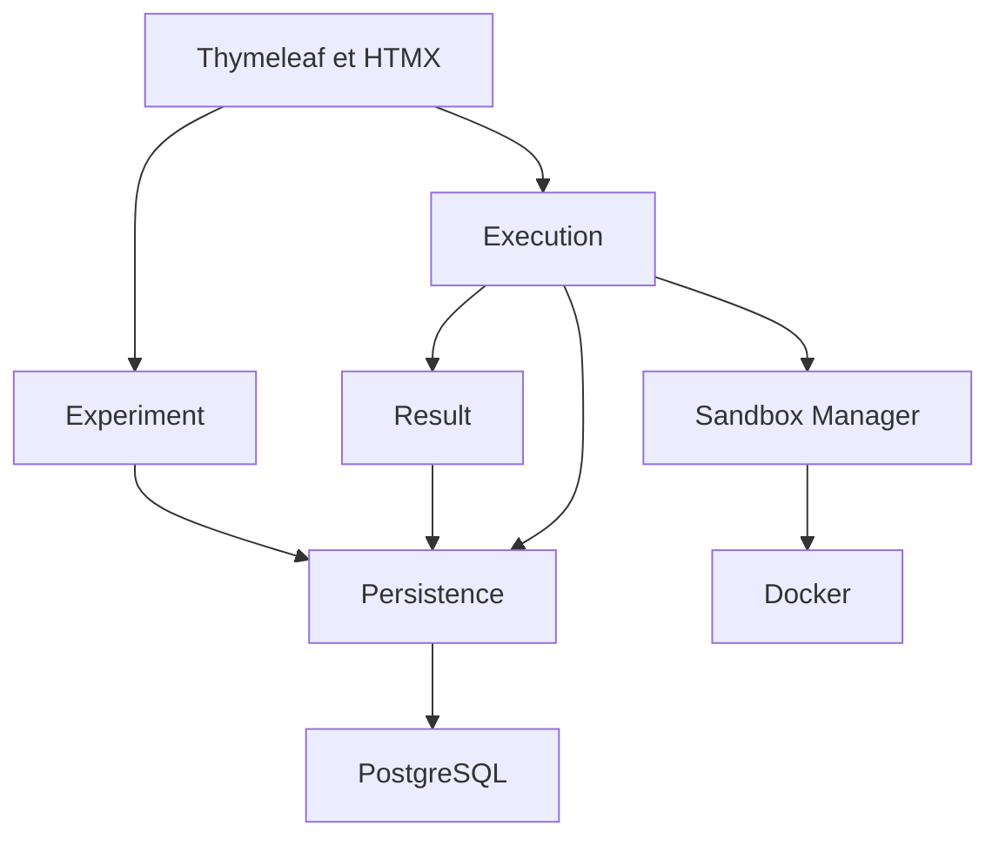

## Objectif

L'application permet d'expérimenter rapidement de nouvelles technologies, méthodes et concepts liés à l'IA dans des environnements isolés.

Elle est destinée aux développeurs et chercheurs souhaitant construire, exécuter et modifier des expérimentations sans impacter directement leur environnement de travail.

Le but principal est de réduire le temps nécessaire pour passer d'une idée à une expérimentation fonctionnelle, tout en permettant de mesurer les résultats, modifier l'expérience et la réexécuter facilement.

## Périmètre V1

* Créer une expérience
* Modifier une expérience
* Lancer une expérience
* Annuler une exécution
* Déclarer les dépendances Python d'une expérience
* Voir le statut d'une exécution
* Consulter le résultat d'une exécution
* Consulter l'historique des exécutions d'une expérience
* Réexécuter une expérience

## Hors V1

* Authentification
* Comparaison avancée des résultats
* Monitoring GPU
* Plugins
* Dépendances entre expériences
* Orchestration de plusieurs expériences

## Cas d'utilisation

### Créer une expérience

L'utilisateur crée une expérience en définissant :

* un nom obligatoire et non vide ;
* une description optionnelle ;
* un timeout optionnel, strictement positif lorsqu'il est renseigné ;
* un script Python optionnel ;
* zéro à plusieurs dépendances Python avec une contrainte de version optionnelle.

L'expérience est ensuite sauvegardée et peut être exécutée plusieurs fois.

### Lancer une expérience

L'utilisateur lance une expérience existante.

Une nouvelle exécution est créée et exécutée dans un environnement isolé.

L'utilisateur peut suivre son statut.

### Consulter un résultat

L'utilisateur consulte une exécution terminée.

Il peut voir :

* le résultat de l'exécution ;
* les métriques produites par le script ;
* les éventuelles erreurs ;
* les informations générales sur l'exécution.

### Consulter l'historique

L'utilisateur consulte les différentes exécutions d'une expérience afin de retrouver les résultats obtenus précédemment.

### Réexécuter une expérience

L'utilisateur peut lancer une nouvelle exécution à partir d'une expérience existante.

## Modèle métier

### Experiment

Rôle : conserve la définition modifiable d'une expérimentation.

Informations : nom, description, script Python, timeout et dépendances Python.

Relations : une expérimentation possède zéro à plusieurs dépendances et exécutions. Plusieurs exécutions peuvent fonctionner simultanément, dans la limite configurée.

### Execution

Rôle : représente une tentative d'exécution. Le Sandbox Manager réalise l'exécution du script.

Informations : statut, dates, timeout appliqué, code de sortie, message d'erreur et logs. La configuration utilisée doit être conservée indépendamment des modifications ultérieures de l'expérience.

Relations : une exécution appartient à une expérimentation et produit zéro à plusieurs résultats.

### Result

Rôle : représente une sortie fonctionnelle explicitement produite par le script.

Informations : nom, type (`TEXT`, `NUMBER`, `MARKDOWN`, `HTML`) et contenu. Un tableau peut être représenté en Markdown ou en HTML.

Relations : chaque résultat appartient à une seule exécution. Les résultats sont consultables dans son historique.

### Statut d'exécution

| Statut | Signification |
|---|---|
| `CREATED` | Exécution enregistrée, en attente ou en préparation du conteneur. |
| `RUNNING` | Le traitement dans le conteneur a commencé : installation des dépendances, puis script. |
| `SUCCESS` | Traitement terminé sans erreur et résultats éventuels valides. |
| `FAILED` | Erreur de préparation, d'installation, de script, de protocole ou interruption applicative. |
| `TIMEOUT` | Durée maximale du traitement atteinte et arrêt confirmé. |
| `CANCELLED` | Annulation acceptée et arrêt confirmé, ou annulation avant tout démarrage. |

## Cycle de vie d'une exécution

| État initial | États suivants autorisés |
|---|---|
| `CREATED` | `RUNNING`, `FAILED`, `CANCELLED` |
| `RUNNING` | `SUCCESS`, `FAILED`, `TIMEOUT`, `CANCELLED` |
| État final | Aucun |

L'échec de création ou de démarrage du conteneur autorise notamment `CREATED → FAILED`.

## Règles métier

### Experiment

Une expérimentation peut être créée avec seulement un nom non vide. La description, le script et le timeout sont optionnels.

### Execution

Un script absent ou vide est traité comme un script sans opération. L'exécution suit le cycle normal et réussit sans résultat si la préparation et l'installation des dépendances réussissent.

Le timeout doit être strictement positif. S'il est absent, la limite appliquée est de 600 secondes. Une exécution terminée avant cette limite peut réussir normalement.

Le timeout commence à `started_at`, au démarrage du traitement dans le conteneur, et inclut l'installation pip et le script. L'attente dans la file est exclue. La préparation Docker dispose d'un délai technique distinct et configurable ; son dépassement produit `FAILED`.

### Statuts et arrêt

Les transitions sont contrôlées de manière atomique afin qu'une fin normale, un timeout et une annulation concurrents ne puissent pas écraser leurs décisions respectives. Une fois enregistré, un état final ne change plus.

Une annulation acceptée ou un timeout doit empêcher tout nouveau démarrage et provoquer l'arrêt du traitement actif. Le code de sortie provoqué par cet arrêt ne doit pas remplacer la cause retenue par `FAILED`.

### Résultats et diagnostics

* `SUCCESS` : zéro à plusieurs résultats valides.
* `FAILED` : message d'erreur et logs disponibles ; les résultats valides déjà produits peuvent être conservés.
* `TIMEOUT` : message indiquant le dépassement, logs disponibles et éventuels résultats valides déjà produits.
* `CANCELLED` : aucun résultat fonctionnel conservé ; les logs disponibles restent accessibles.

Les messages d'erreur et les logs appartiennent à l'exécution et ne sont pas des `Result`.

## Architecture

### Frontend

Responsabilité :
Permettre à l'utilisateur de créer et modifier une expérimentation, lancer ou annuler une exécution, suivre son statut et consulter ses résultats et son historique.

### Backend

Responsabilité :
Recevoir et valider les actions de l'utilisateur, appliquer les règles métier, gérer les expérimentations et les exécutions, communiquer avec le stockage et demander au Sandbox Manager de lancer ou arrêter une exécution.

### Sandbox Manager

Responsabilité :
Créer, démarrer, surveiller, arrêter et détruire les environnements isolés nécessaires aux exécutions.

### Sandbox

Responsabilité :
Fournir un environnement isolé dans lequel le script d'une expérimentation est exécuté sans impacter directement le système hôte.

### Stockage

Responsabilité :
Conserver durablement les expérimentations, les exécutions, leurs statuts, leurs résultats et les informations nécessaires à leur historique.


## Flux principal d'une exécution

1. L'utilisateur demande le lancement d'une expérience.
2. Le Backend valide l'expérience et sa configuration.
3. Il enregistre une `Execution` en `CREATED`, son timeout effectif et une copie de la configuration utilisée.
4. Après validation de la transaction, le traitement est confié au mécanisme asynchrone. La réponse HTTP n'attend pas la fin de l'exécution.
5. Lorsqu'une place est disponible, le Sandbox Manager prépare un conteneur dédié et lui fournit le script et les dépendances.
6. Au démarrage du traitement dans le conteneur, l'exécution passe à `RUNNING` et `started_at` est enregistré.
7. Le conteneur installe les dépendances avec pip, puis lance le script si l'installation réussit.
8. Le système surveille la fin du traitement, le timeout et les demandes d'annulation.
9. Si nécessaire, il force l'arrêt et en vérifie l'effectivité.
10. Il récupère le code de sortie, les logs et les résultats disponibles, puis valide le protocole de résultats.
11. Il sauvegarde l'état final, `finished_at`, les diagnostics et les résultats autorisés dans une transaction.
12. Après sauvegarde, le Sandbox Manager supprime le conteneur et ses fichiers temporaires.
13. L'utilisateur consulte le statut, les résultats et les diagnostics.

Une erreur de nettoyage ne modifie pas un état final déjà enregistré : elle est journalisée et le nettoyage est retenté. Si la sauvegarde échoue, le conteneur doit être arrêté ; les données disponibles sont conservées pour permettre la reprise avant suppression.

## Décisions restant à préciser

Les choix déjà actés sont Docker, un Sandbox Manager interne au monolithe, Python pour la V1 et des appels Java entre modules.

Les points suivants restent à trancher lors de l'implémentation :

* client Java utilisé pour communiquer avec Docker ;
* transfert du script et des dépendances, emplacement du fichier de résultats et schéma JSON exact ;
* valeurs par défaut des limites CPU, RAM, processus, disque, logs et résultats ;
* délai technique de préparation et taille de la file d'attente ;
* politique réseau pour pip et pour le script, notamment pour une exécution sans Internet ;
* mécanisme de protection du rendu HTML et Markdown ;
* représentation de la configuration historique, des versions Python et des packages effectivement installés.

La gestion avancée du GPU, les fichiers arbitraires comme résultats et la réexécution strictement reproductible restent des extensions à cadrer.

# Conception technique
## 1. Stack technique

### Backend
- Java
- Spring Boot
- Spring MVC
- Spring Data JPA

### Frontend
- Thymeleaf
- HTMX
- HTML/CSS

### Base de données
- PostgreSQL
- Flyway pour les migrations du schéma

### Sandboxing
- Docker

### Tests
- JUnit
- Testcontainers

### Build
- Maven

## 2. Architecture technique

L'application est construite sous la forme d'un monolithe Spring Boot.

Le Sandbox Manager est un module interne du Backend. Il est responsable de la gestion du cycle de vie des sandboxes et communique avec Docker pour créer, démarrer, surveiller, arrêter et supprimer les conteneurs utilisés par les exécutions.

### Composants

#### Web

Responsable de l'interface utilisateur avec Thymeleaf et HTMX ainsi que de la réception des actions utilisateur.

#### Experiment

Responsable de la gestion des expérimentations : création, modification et consultation.

#### Execution

Responsable de la création des exécutions, de leur cycle de vie et de leur statut.

#### Sandbox Manager

Responsable de la préparation et du contrôle des environnements d'exécution isolés.

Il utilise Docker pour :

* créer un sandbox ;
* démarrer un sandbox ;
* arrêter un sandbox ;
* supprimer un sandbox ;
* récupérer son état.

#### Result

Responsable de la récupération et de la conservation des résultats produits par une exécution.

#### Persistence

Responsable de la persistance des expérimentations, exécutions et résultats dans PostgreSQL.

### Vue générale



## 3. Modèle de données

### Table `experiment`

Représente une expérimentation enregistrée dans l'application.

Champs :

* `id` : identifiant unique
* `name` : nom de l'expérimentation
* `description` : description optionnelle
* `script` : contenu du script à exécuter
* `timeout_seconds` : timeout défini pour l'expérimentation
* `created_at` : date de création
* `updated_at` : date de dernière modification

Contraintes :

* `name` obligatoire et non vide
* `description` optionnelle
* `script` optionnel
* si `timeout_seconds` est absent, la valeur par défaut appliquée lors de l'exécution est de 600 secondes

---

### Table `experiment_dependency`

Représente une dépendance Python nécessaire à l'exécution d'une expérimentation.

Champs :

* `id` : identifiant unique
* `experiment_id` : expérimentation associée
* `package_name` : nom du package Python
* `version_constraint` : contrainte de version optionnelle
* `created_at` : date de création

Exemples :

```text
torch
transformers==5.2.0
numpy>=2.0
accelerate~=1.3
```

Relations :

* une `Experiment` peut avoir zéro à plusieurs `ExperimentDependency`
* une `ExperimentDependency` appartient à une seule `Experiment`

Contraintes :

* `package_name` obligatoire
* `version_constraint` optionnelle
* un même `package_name` ne peut apparaître qu'une fois par expérimentation, conformément à la contrainte SQL `(experiment_id, package_name)` ; la normalisation des noms doit être appliquée avant sauvegarde

---

### Table `execution`

Représente une tentative d'exécution d'une expérimentation.

Champs :

* `id` : identifiant unique
* `experiment_id` : expérimentation associée
* `status` : statut de l'exécution
* `created_at` : date de création
* `started_at` : date de démarrage
* `finished_at` : date de fin
* `timeout_seconds` : timeout réellement utilisé pour cette exécution
* `error_message` : message d'erreur éventuel
* `exit_code` : code de sortie, optionnel si aucun processus n'a démarré
* `stdout_log` : sortie standard disponible
* `stderr_log` : sortie d'erreur disponible

Valeurs possibles pour `status` :

* `CREATED`
* `RUNNING`
* `SUCCESS`
* `FAILED`
* `TIMEOUT`
* `CANCELLED`

Relations :

* une `Experiment` possède plusieurs `Execution`
* une `Execution` appartient à une seule `Experiment`

Le timeout effectif est copié au lancement et ne change plus pour cette exécution. `started_at` reste absent si le traitement n'a pas démarré. `finished_at` est renseigné pour tout état final.

### Configuration historique : évolution du schéma à prévoir

La migration actuelle `V1__create_initial_schema.sql` contient les quatre tables décrites ici, avec les logs et le code de sortie. Elle ne contient pas encore de snapshot du script ni des dépendances.

Avant de s'appuyer sur l'historique pour retrouver la configuration exécutée, une nouvelle migration devra prévoir :

* une copie du script dans `execution`, par exemple `script_snapshot` ;
* une copie des dépendances déclarées, par exemple dans une table `execution_dependency` liée à `execution` ;
* l'identification de l'image utilisée et, si disponibles, les versions Python et packages effectivement installés.

Le lancement doit lire une configuration cohérente et en conserver la copie avant de confier l'exécution au worker. Une modification ultérieure de l'expérience ne doit pas changer cette copie.

Ces évolutions sont prévues dans la conception, mais ne sont pas présentes dans le SQL actuel. Une migration déjà appliquée doit être complétée par une nouvelle migration.

La conservation des contraintes pip ne garantit pas une reproduction exacte : les dépendances transitives, les images, les données externes et l'aléatoire peuvent changer.

---

### Table `result`

Représente une sortie produite par une exécution.

Champs :

* `id` : identifiant unique
* `execution_id` : exécution associée
* `name` : nom ou identifiant du résultat
* `type` : type du résultat
* `content` : contenu du résultat
* `created_at` : date de création

Types de résultat possibles dans la V1 :

* `TEXT`
* `NUMBER`
* `MARKDOWN`
* `HTML`

Relations :

* une `Execution` peut produire zéro à plusieurs `Result`
* un `Result` appartient à une seule `Execution`

---

### Relations

| Parent | Enfant | Cardinalité |
|---|---|---|
| `Experiment` | `ExperimentDependency` | Une expérience possède zéro à plusieurs dépendances. |
| `Experiment` | `Execution` | Une expérience possède zéro à plusieurs exécutions. |
| `Execution` | `Result` | Une exécution produit zéro à plusieurs résultats. |

Chaque enfant référence exactement un parent. La future table de snapshots des dépendances référencera `Execution`.

Dans la migration actuelle, les clés étrangères utilisent `ON DELETE CASCADE` : supprimer une expérience supprimerait aussi ses dépendances, ses exécutions et leurs résultats. La suppression d'une expérience n'est pas proposée dans le périmètre V1.

### Historique

Aucune table `history` n'est nécessaire.

L'historique d'une expérimentation correspond simplement à l'ensemble de ses exécutions, ordonnées par date.

### Durée d'une exécution

La durée n'est pas stockée directement.

| Situation | Durée affichée |
|---|---|
| Traitement en cours | Date actuelle moins `started_at`. |
| Traitement terminé après démarrage | `finished_at - started_at`. |
| Traitement jamais démarré | Non applicable. |

Le temps d'attente et de préparation est distinct du temps de traitement. `updated_at` doit être actualisé à chaque modification d'une expérience : sa valeur SQL par défaut ne le met pas automatiquement à jour.

## 4. API et échanges entre composants

### Interface utilisateur

L'interface utilisateur est générée côté serveur avec Thymeleaf.

HTMX est utilisé lorsque des interactions dynamiques sont nécessaires, notamment pour :

* lancer une exécution ;
* annuler une exécution ;
* actualiser son statut ;
* afficher les résultats sans recharger entièrement la page.

Le Frontend communique uniquement avec le Backend Spring Boot.

### Routes principales

#### Expérimentations

* `GET /experiments` : afficher les expérimentations
* `GET /experiments/new` : afficher le formulaire de création
* `POST /experiments` : créer une expérimentation
* `GET /experiments/{id}` : afficher une expérimentation
* `GET /experiments/{id}/edit` : afficher le formulaire de modification
* `POST /experiments/{id}` : modifier une expérimentation

#### Exécutions

* `POST /experiments/{id}/executions` : lancer une nouvelle exécution
* `GET /executions/{id}` : consulter une exécution
* `POST /executions/{id}/cancel` : annuler une exécution
* `GET /executions/{id}/status` : récupérer le statut d'une exécution
* `GET /experiments/{id}/executions` : consulter l'historique des exécutions

Les routes exactes pourront évoluer pendant l'implémentation.

### Échanges Backend / Sandbox Manager

Le Sandbox Manager étant un module interne de l'application, la communication se fait directement par appels Java.

Le module `Execution` demande au Sandbox Manager :

* de préparer un sandbox ;
* d'exécuter un script ;
* de récupérer son état ;
* de l'arrêter ;
* de le supprimer.

Le reste de l'application ne communique pas directement avec Docker.

---

## 5. Gestion des exécutions

Les exécutions sont traitées de manière asynchrone afin qu'une requête HTTP ne reste pas ouverte pendant toute la durée d'une expérimentation.

### Lancement

Le lancement suit le flux principal défini plus haut. Le worker ne démarre qu'après validation de la transaction qui crée l'exécution.

Une erreur de soumission au worker doit être prise en charge : l'exécution ne doit pas rester bloquée en `CREATED`. La V1 doit également distinguer une exécution en attente normale d'une exécution abandonnée après redémarrage.

### États finaux

Une exécution peut terminer avec :

* `SUCCESS`
* `FAILED`
* `TIMEOUT`
* `CANCELLED`

Un état final est immuable, y compris vis-à-vis des autres états finaux.

### Exécutions simultanées

Plusieurs exécutions peuvent fonctionner simultanément.

La V1 utilisera un nombre limité d'exécutions concurrentes afin d'éviter d'épuiser les ressources de la machine.

La valeur exacte de cette limite sera configurable.

### Annulation

1. Le système vérifie et réserve atomiquement la demande si aucun état final ni autre cause d'arrêt n'a déjà été retenu.
2. Il empêche le worker de démarrer un traitement annulé en attente.
3. Si un conteneur existe, il l'arrête et confirme son arrêt.
4. Il récupère les logs disponibles, enregistre `CANCELLED` et `finished_at`, sans résultat fonctionnel.
5. Il supprime le conteneur après sauvegarde.

Une demande répétée est sans effet supplémentaire. Si Docker est inaccessible, le système conserve la demande et retente l'arrêt ; il ne présente pas l'arrêt comme confirmé.

### Timeout

Le timeout enregistré dans `Execution` inclut l'installation pip et le script, à partir de `started_at`. La valeur par défaut est de 600 secondes.

À l'échéance, le système réserve la cause `TIMEOUT`, arrête le traitement, vérifie l'arrêt, récupère les sorties disponibles et sauvegarde le statut final avant de supprimer le conteneur.

La surveillance doit rester active pendant l'installation des dépendances. Une erreur pip avant l'échéance donne `FAILED` et empêche le lancement du script.

---

## 6. Gestion des sandboxes

### Principe

Chaque exécution dispose de son propre environnement isolé.

Dans la V1, les sandboxes sont implémentés avec Docker.

Le module `Execution` sollicite le Sandbox Manager, qui pilote Docker pour exécuter le script dans un conteneur dédié.

### Cycle de vie

Pour chaque exécution, le Sandbox Manager :

1. prépare la configuration du sandbox ;
2. crée le conteneur ;
3. fournit le script au conteneur ;
4. démarre le conteneur ;
5. surveille son exécution ;
6. confirme la fin du traitement ou arrête le conteneur si nécessaire ;
7. récupère les sorties et attend leur sauvegarde avec l'état final ;
8. supprime le conteneur et les fichiers temporaires.

### Identification

Chaque sandbox doit être associé de manière unique à une `Execution`.

L'identifiant de l'exécution pourra être utilisé dans les métadonnées ou labels Docker afin de retrouver le conteneur correspondant.

### Images Docker

La V1 commence avec un nombre limité d'environnements supportés.

La V1 utilise un environnement Python pour exécuter les scripts et installer leurs dépendances avec pip.

Les images disponibles sont contrôlées par l'application.

L'utilisateur ne fournit pas directement une image Docker arbitraire dans la V1.

### Ressources

Les sandboxes doivent pouvoir être limités en :

* mémoire ;
* CPU ;
* durée d'exécution.

La gestion avancée du GPU n'est pas nécessaire pour la première version.

### Dépendances Python

Le Backend construit une liste de dépendances à partir des noms et contraintes validés. L'installation pip s'effectue dans le conteneur dédié, jamais dans l'environnement Spring Boot ou sur l'hôte. Les logs d'installation sont conservés avec ceux de l'exécution.

Le script n'est lancé que si l'installation réussit. L'accès aux index de packages doit être compatible avec la politique réseau choisie : un traitement sans réseau nécessite des dépendances déjà disponibles dans l'image ou dans un cache contrôlé. Les détails de ce mécanisme restent à définir.

### Nettoyage

Un sandbox doit normalement être supprimé après chaque exécution, quel que soit son résultat.

Le Sandbox Manager doit également pouvoir détecter et supprimer les sandboxes laissés dans un état incohérent après un problème applicatif.

---

## 7. Gestion des résultats et logs

### Résultats

Une exécution peut produire zéro à plusieurs résultats.

Les résultats sont explicitement produits par le script selon un format défini par l'application.

Types supportés dans la V1 :

* `TEXT`
* `NUMBER`
* `MARKDOWN`
* `HTML`

Chaque résultat possède :

* un nom ;
* un type ;
* un contenu.

### Format d'échange

Un format standard devra être défini entre le script et l'application.

Exemple conceptuel :

```json
{
  "results": [
    {
      "name": "accuracy",
      "type": "NUMBER",
      "content": "0.94"
    },
    {
      "name": "report",
      "type": "MARKDOWN",
      "content": "## Résultat\n..."
    }
  ]
}
```

Le format exact et son canal de transfert seront définis pendant l'implémentation. Les logs doivent rester distincts du document de résultats. Une absence de résultats est autorisée ; un document présent mais invalide produit `FAILED`, même si le processus retourne zéro. Les erreurs de protocole sont enregistrées dans les diagnostics.

### Logs

Les logs techniques sont séparés des résultats.

Deux flux sont distingués :

* `stdout`
* `stderr`

Les logs permettent de comprendre le déroulement d'une expérimentation et de diagnostiquer une erreur.

Ils ne sont pas considérés comme des `Result`.

Pour la V1, les logs peuvent être récupérés à la fin de l'exécution et conservés avec l'exécution.

Une gestion temps réel des logs pourra être ajoutée ultérieurement.

### Erreurs

Lorsqu'une exécution échoue, le message d'erreur et les logs disponibles sont conservés.

Une exécution `FAILED` peut donc ne produire aucun résultat fonctionnel tout en conservant les informations nécessaires au diagnostic.

---

## 8. Gestion des erreurs et reprise

### Erreur du script

Si le script termine avec une erreur :

* l'exécution passe à `FAILED` ;
* le code de sortie est conservé si disponible ;
* `stdout` et `stderr` sont récupérés ;
* le message d'erreur est conservé ;
* le sandbox est supprimé.

### Erreur de création du sandbox

Si le sandbox ne peut pas être créé ou démarré :

* l'exécution passe à `FAILED` ;
* l'erreur technique est conservée ;
* aucune tentative automatique de relance n'est effectuée dans la V1.

### Erreur de l'application

Au démarrage, avant d'accepter de nouveaux traitements, l'application rapproche les exécutions enregistrées des conteneurs identifiés par ses propres labels.

| Situation | Comportement attendu |
|---|---|
| `CREATED` sans conteneur après redémarrage | Marquer `FAILED` avec un diagnostic d'interruption ; pas de relance automatique en V1. |
| `RUNNING` sans conteneur | Marquer `FAILED` et renseigner la date de constat de l'interruption. |
| Conteneur terminé, exécution non finale | Récupérer les sorties et finaliser selon le code de sortie, le protocole et la cause d'arrêt connue. |
| Conteneur encore actif | Rétablir la surveillance et appliquer le timeout depuis le `started_at` d'origine ; arrêter immédiatement si l'échéance est dépassée. |
| Exécution finale avec conteneur restant | Confirmer son arrêt et terminer le nettoyage. |
| Conteneur de l'application sans exécution associée | L'arrêter puis le supprimer. |
| Docker inaccessible | Journaliser et retenter la réconciliation ; ne pas confondre une erreur d'accès avec un conteneur absent. |

Les demandes d'arrêt acceptées doivent pouvoir être retrouvées après redémarrage ; leur représentation persistante reste à ajouter au schéma. Un conteneur actif dont la configuration de surveillance ne peut pas être retrouvée doit être arrêté et l'exécution marquée `FAILED` après confirmation.

La reprise utilise les mêmes règles de sauvegarde avant suppression que le flux normal.

### Retry

La V1 ne relance pas automatiquement une exécution échouée.

L'utilisateur peut manuellement réexécuter l'expérimentation avec sa configuration actuelle, ce qui crée une nouvelle `Execution`. Rejouer exactement une ancienne configuration est une fonctionnalité distincte, non garantie par la V1.

L'ancienne exécution reste conservée dans l'historique.

---

## 9. Sécurité et isolation

### Principe

Les scripts exécutés doivent être considérés comme potentiellement dangereux.

Ils ne doivent pas être exécutés directement par le processus Spring Boot ni directement sur le système hôte.

### Isolation

Chaque script est exécuté dans un conteneur Docker dédié.

Le conteneur doit utiliser le minimum de permissions nécessaires.

### Accès au système hôte

Par défaut, un sandbox ne doit pas :

* accéder au système de fichiers de l'hôte ;
* accéder au socket Docker ;
* lancer des conteneurs supplémentaires ;
* disposer de privilèges élevés.

Les volumes montés dans le sandbox doivent être explicitement contrôlés par le Sandbox Manager.

### Réseau

La politique réseau doit être restrictive.

Pour la V1, l'accès réseau doit être configurable selon les besoins de l'expérimentation.

Une expérimentation ne nécessitant pas Internet devrait pouvoir être exécutée sans accès réseau.

### Ressources

Les limites de CPU, mémoire et timeout empêchent une expérimentation de monopoliser indéfiniment les ressources de la machine.

### HTML produit par les scripts

Les résultats HTML doivent être considérés comme non fiables.

Ils ne doivent pas être injectés directement dans l'interface sans mécanisme de protection adapté afin d'éviter l'exécution de contenu malveillant dans le navigateur.

### Secrets

Aucun secret de l'application, identifiant de base de données ou information sensible ne doit être automatiquement transmis aux sandboxes.

---

## 10. Tests techniques

### Tests unitaires

Les règles métier principales doivent être testées indépendamment de Docker et PostgreSQL.

Exemples :

* transitions de statut autorisées ;
* calcul du timeout ;
* validation d'une expérimentation ;
* comportement lors d'une annulation.

### Tests d'intégration PostgreSQL

Testcontainers est utilisé pour lancer une véritable instance PostgreSQL pendant les tests.

Les tests vérifient notamment :

* la persistance des expérimentations ;
* la persistance des exécutions ;
* les relations entre les entités ;
* la persistance des résultats ;
* la récupération de l'historique.

### Tests d'intégration Docker

Une série de tests vérifie le Sandbox Manager avec de véritables conteneurs.

Scénarios minimum :

* exécution réussie ;
* script sans résultat ;
* script en erreur ;
* script dépassant le timeout ;
* annulation d'une exécution ;
* récupération des logs ;
* destruction correcte du sandbox.

### Tests du flux complet

Un test de bout en bout doit couvrir le scénario principal :

Créer une expérience, lancer une exécution, exécuter le script dans un conteneur, sauvegarder les résultats avec le statut `SUCCESS`, nettoyer le conteneur puis consulter les résultats.

### Tests de nettoyage

Des tests spécifiques doivent vérifier qu'aucun sandbox ne reste actif après :

* `SUCCESS`
* `FAILED`
* `TIMEOUT`
* `CANCELLED`

### Tests des cas limites

Les cas suivants doivent également être couverts :

* expérimentation sans script ;
* expérimentation sans timeout ;
* script retournant plusieurs résultats ;
* résultat invalide ;
* erreur Docker ;
* plusieurs exécutions simultanées ;
* échec et timeout pendant l'installation pip ;
* annulation avant démarrage et pendant la préparation ;
* concurrence entre fin normale, timeout et annulation ;
* reprise après interruption applicative ;
* échec de sauvegarde ou de nettoyage ;
* modification d'une expérience après lancement, sans modification de sa configuration copiée.

